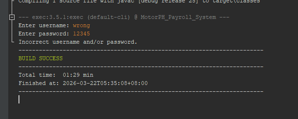
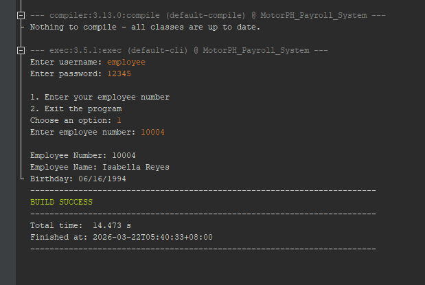
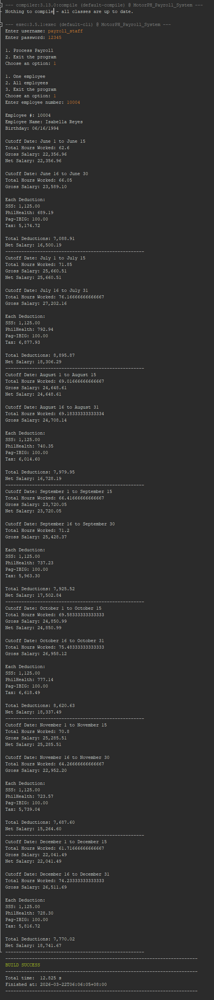
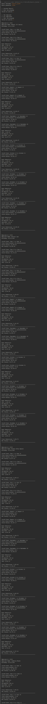
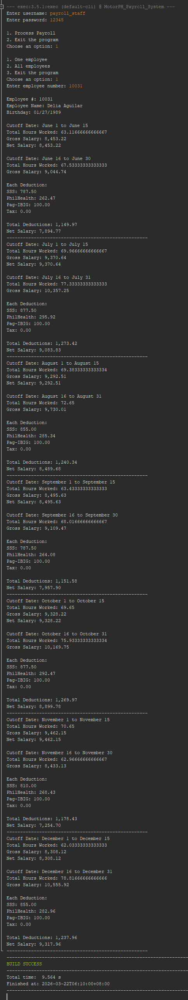

# MotorPH Payroll Processing System

## Project Summary

The **MotorPH Payroll Processing System** is a Java console application designed to automate the computation of employee payroll. The program reads employee information, hourly rates, and attendance records directly from CSV files and calculates the total hours worked and the corresponding salary for each cutoff period.

The system supports semi-monthly payroll computation and applies the required government deductions such as **SSS, PhilHealth, Pag-IBIG, and withholding tax**. The deductions are computed based on the employee’s total monthly salary, and they are applied during the **second cutoff payout**.

The program includes two user roles:

* **Employee** – allows employees to view their personal information.
* **Payroll Staff** – allows payroll personnel to process payroll for one employee or all employees.

The system ensures that all payroll computations follow the required business rules, including:

* Reading all data from CSV files.
* Processing attendance records from **June to December**.
* Calculating work hours only between **8:00 AM and 5:00 PM**.
* Applying government deductions correctly based on payroll policies.

---

## Team Contributions

| Action Item                           | Person Assigned |
| :------------------------------------ | :-------------- |
| Implement core system functions       | Jose            |
| Apply business rules and computations | Bryan           |
| Validate system outputs               | Bryan / Chona   |
| Fix identified issues                 | Jose            |
| Finalize system logic                 | Chona           |
| Create QA review questions            | Bryan           |
| Conduct system testing                | Chona           |
| Import project to GitHub repository   | Jose            |
| Create README details                 | Bryan / Jose    |

---

## Program Details

The system performs the following operations:

1. **User Authentication**

   * The program requires a username and password before accessing the system.
   * Valid usernames:
     * `employee`
     * `payroll_staff`
   * Password for both accounts: `12345`

2. **Employee Mode**

   * The user enters their **employee number**.
   * The program displays:
     * Employee Number
     * Employee Name
     * Birthday
   * If the employee number does not exist, the system displays an error message.

3. **Payroll Staff Mode**

   * Allows payroll processing for:
     * One employee
     * All employees

   * The system calculates:
     * Total hours worked per cutoff
     * Gross salary
     * Government deductions
     * Net salary

4. **Payroll Rules**

   * Payroll is calculated **semi-monthly**:
     * 1st cutoff: Day 1–15
     * 2nd cutoff: Day 16–end of month

   * Only working hours between **8:00 AM and 5:00 PM** are counted.
   * Extra hours beyond 5:00 PM are **not included**.
   * Government deductions are applied during the **second cutoff**.
   * All computations follow the required payroll rules and constraints.

---

## How to Run the Program

1. Clone or download this repository.

2. Open the project using **NetBeans IDE** or any Java IDE.

3. Make sure the required CSV files are located in the `resources` folder:

   * `Employee_Details.csv`
   * `Employee_Attendance_Record.csv`
   * `SSS_Contribution.csv`

4. Run the file:

   ```
   MotorPH_Payroll_System.java
   ```

5. Log in using one of the following accounts:

| Username      | Password | Access                    |
| ------------- | -------- | ------------------------- |
| employee      | 12345    | View employee information |
| payroll_staff | 12345    | Process payroll           |

6. Follow the menu prompts displayed in the console.

---

## Test Cases and Validation

The system was tested using multiple scenarios to verify correctness and compliance with business rules.

### Test Case 1 – Valid Employee Login
- Displays correct employee information

### Test Case 2 – Invalid Login
- Displays error and terminates program

### Test Case 3 – Payroll Staff (One Employee)
- Displays payroll from June to December
- Shows both cutoffs
- Applies deductions correctly

### Test Case 4 – Invalid Employee Number
- Displays error message

### Test Case 5 – Hours Worked Validation
- 8:30–5:30 → 7.5 hours
- 8:05–5:00 → 8.0 hours
- 8:05–4:30 → 7.5 hours

### Test Case 6 – Deduction Validation
- Below threshold → no tax
- Above threshold → correct tax

---

## Sample Output Screenshots

### Invalid Login


### Employee Mode – Valid Employee Lookup (ID 10004)


### Payroll – One Employee with Tax Deduction (ID 10004)


### Payroll – All Employees


### Edge Case – No Tax Scenario (ID 10031)


---

## Final Improvements (Based on Feedback)

After reviewing the feedback provided, the following improvements were implemented:

- Added Javadoc-style documentation for all methods to improve readability and clarity.
- Improved input validation for menu options and employee number entries.
- Standardized variable naming conventions (e.g., empId).
- Updated CSV parsing to consistently use a custom parser for handling quoted fields.
- Applied proper formatting for monetary values (two decimal places for display).
- Removed debug statements to ensure clean and professional output.
- Documented system constraints such as June–December data coverage.

All improvements were implemented while strictly following the original project requirements and constraints:

- No use of OOP concepts
- Single Java file implementation
- All data is read directly from CSV files without modification
- Payroll computations follow the defined business rules and cutoff structure

---

## System Limitations

The system was developed based on the given project constraints and requirements. The following limitations are acknowledged:

- The program only processes payroll data from June to December as specified in the requirements.
- The system uses a single Java file and does not implement OOP concepts, following course constraints.
- CSV parsing uses a fixed-size array, which is sufficient for the provided dataset but may not scale for larger or more complex files.
- The SSS contribution table is read directly from the CSV file during computation, which may affect performance for large datasets.
- The system assumes correctly formatted CSV input files and does not include advanced error handling for corrupted or inconsistent data.

These limitations were intentionally maintained to comply with the project guidelines while ensuring correct and reliable payroll computation.

---

## Project Monitoring and QA Review

The team followed the project plan throughout development to monitor tasks, deadlines, and progress.

The system underwent QA review to validate:
- login flow
- menu navigation
- employee lookup
- payroll computation
- deductions
- output formatting
- input validation

All identified issues were corrected before submission.

---

## Project Plan

A local copy of the project plan file (.xlsx) is included in this repository for offline review.

The project plan has been completed and followed throughout the development process. The system is currently undergoing QA review and validation with a partner group before final submission.

Project Plan Link:
[https://docs.google.com/spreadsheets/d/175Dt-jGeGFrfU_b4RWYh5RLDrJOeSHZan4qwJ6O06l4/edit?usp=sharing](url)
