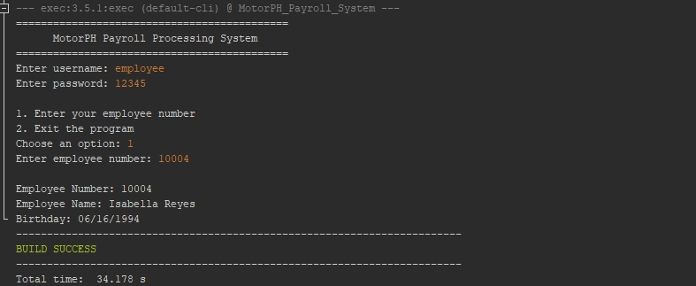
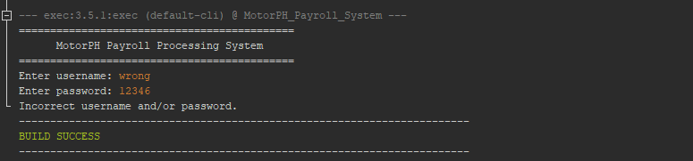
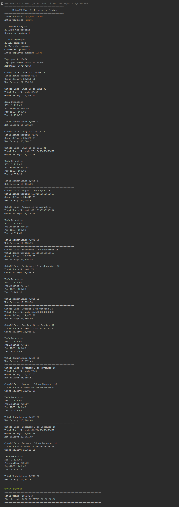
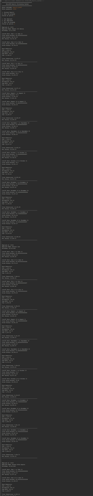
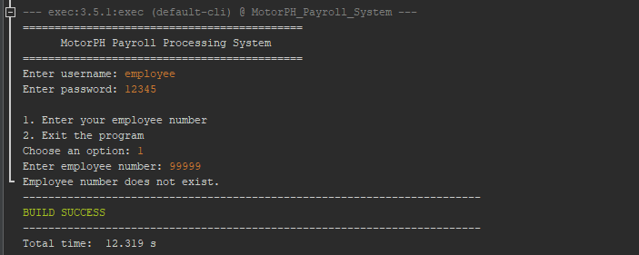
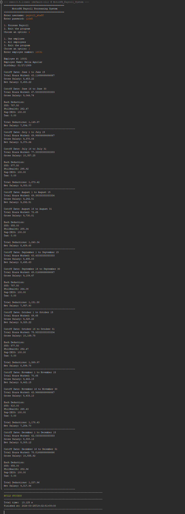
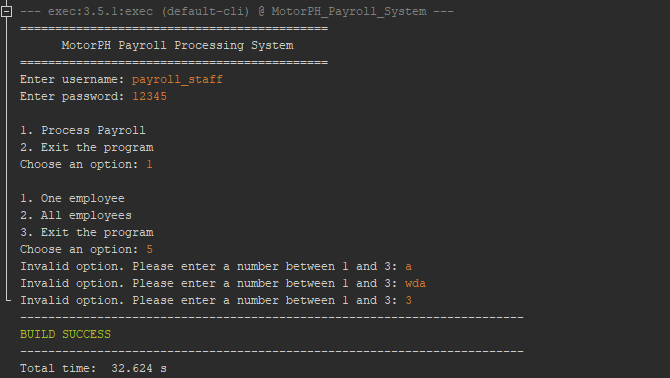

# MotorPH Payroll Processing System

## Project Summary

The **MotorPH Payroll Processing System** is a Java console application designed to automate the computation of employee payroll using CSV files as the only data source. The program reads employee information, hourly rates, attendance records, and SSS contribution brackets directly from CSV files and calculates total hours worked, gross salary, government deductions, and net salary per payroll cutoff.

The system supports semi-monthly payroll computation and applies the required government deductions such as **SSS, PhilHealth, Pag-IBIG, and withholding tax**. The deductions are computed based on the employee’s total monthly salary and are applied during the **second cutoff payout**.

The program includes two user roles:

- **Employee** – allows employees to view their personal information  
- **Payroll Staff** – allows payroll personnel to process payroll for one employee or all employees  

The system follows the required project constraints:

- **one Java file only**  
- **procedural programming only**  
- **no OOP concepts**  
- **all data is read directly from CSV files**  
- **attendance processing is limited to June to December**

---

## Team Contributions

| Action Item | Person Assigned |
|---|---|
| Implement core system functions | Jose |
| Apply business rules and computations | Bryan |
| Validate system outputs | Bryan / Chona |
| Fix identified issues | Jose |
| Finalize system logic | Chona |
| Create QA review questions | Bryan |
| Conduct system testing | Chona |
| Import project to GitHub repository | Jose |
| Create README details | Bryan / Jose |

---

## Program Details

### 1. User Authentication
- The program requires a username and password before accessing the system.
- Valid usernames:
  - `employee`
  - `payroll_staff`
- Password for both accounts: `12345`

---

### 2. Employee Mode
- The user enters their **employee number**.
- The program displays:
  - Employee Number
  - Employee Name
  - Birthday
- If the employee number does not exist, the system displays an error message.

---

### 3. Payroll Staff Mode
- Allows payroll processing for:
  - One employee
  - All employees
- The system calculates:
  - Total hours worked per cutoff
  - Gross salary
  - Government deductions
  - Net salary

---

### 4. Payroll Rules
- Payroll is calculated **semi-monthly**:
  - 1st cutoff: Day 1–15  
  - 2nd cutoff: Day 16–end of month  
- Only working hours between **8:00 AM and 5:00 PM** are counted.  
- Login between **8:00 AM and 8:10 AM** is treated as **8:00 AM**.  
- Extra hours beyond **5:00 PM** are not included.  
- A **1-hour lunch break** is deducted.  
- Government deductions are applied during the **second cutoff only**.  
- Attendance coverage is limited to **June to December**.

---

## How to Run the Program

1. Clone or download this repository.  
2. Open the project using **NetBeans IDE** or any Java IDE.  
3. Make sure the required CSV files are located in the `resources` folder:
   - `Employee_Details.csv`
   - `Employee_Attendance_Record.csv`
   - `SSS_Contribution.csv`

4. Run the Java file:  
MotorPH_Payroll_System.java

5. Log in using one of the following accounts:

| Username | Password | Access |
|---|---|---|
| employee | 12345 | View employee information |
| payroll_staff | 12345 | Process payroll |

6. Follow the menu prompts displayed in the console.

---

## Test Cases and Validation

The system was tested using multiple scenarios to verify correctness and compliance with the business rules.

| Test ID | Scenario | Sample Input | Expected Result | Evidence |
|---|---|---|---|---|
| TC-01 | Valid employee login | `employee / 12345`, employee no. `10004` | Displays correct employee information | `images/tc01_employee.png` |
| TC-02 | Invalid login | invalid username/password | Displays login error | `images/tc02_invalid_login.png` |
| TC-03 | Payroll staff - one employee | employee no. `10004` | Displays payroll June–December | `images/tc03_payroll_one.png` |
| TC-04 | Payroll staff - all employees | option `2` | Displays all payroll records | `images/tc04_payroll_all.png` |
| TC-05 | Invalid employee number | `99999` | Displays error message | `images/tc05_invalid_employee.png` |
| TC-06 | Hours worked validation | manual | Matches expected hours | manual verification |
| TC-07 | No tax scenario | employee no. `10031` | Tax = 0.00 | `images/tc07_no_tax.png` |
| TC-08 | Invalid menu input | invalid option | Re-prompts user | `images/tc08_invalid_menu.png` |

---

## Manual Verification Notes

### Hours Worked Rule Check

| Time In | Time Out | Expected Hours | Reason |
|---|---|---|---|
| 8:30 AM | 5:30 PM | 7.5 | Logout capped at 5:00 PM |
| 8:05 AM | 5:00 PM | 8.0 | Treated as 8:00 AM |
| 8:05 AM | 4:30 PM | 7.5 | Minus lunch |

---

### Deduction Check

- **SSS** → Based on CSV bracket table  
- **PhilHealth** → 3% of monthly gross ÷ 2  
- **Pag-IBIG** → Capped at 100  
- **Tax** → Based on taxable income  
- Applied only in **second cutoff**

---

## Sample Output Screenshots

### TC-01: Employee Mode

---

### TC-02: Invalid Login

---

### TC-03: Payroll (One Employee)

---

### TC-04: Payroll (All Employees)

---

### TC-05: Invalid Employee Number

---

### TC-07: No Tax Case

---

### TC-08: Invalid Menu Input

---

## Improvements Applied After Review

### Code Improvements
- Improved input validation
- Cleaner main flow
- Consistent variable naming
- Safer CSV parsing
- Better output formatting

### Documentation Improvements
- Stronger test case alignment
- Added missing validation evidence
- Improved clarity and auditability

---

## System Limitations

- Only processes June–December  
- Single Java file (no OOP)  
- Assumes valid CSV format  
- SSS computation remains CSV-based (original logic preserved)  

---

## Project Monitoring and QA Review

The system was reviewed for:
- login flow  
- menu validation  
- payroll computation  
- deduction accuracy  
- output formatting  

Issues were resolved without changing core logic.

---

## Project Plan

[MotorPH Project Plan](https://docs.google.com/spreadsheets/d/175Dt-jGeGFrfU_b4RWYh5RLDrJOeSHZan4qwJ6O06l4/edit?usp=sharing)

---

## Final Notes

This project satisfies all constraints while maintaining correctness, clarity, and verifiable outputs. Improvements focused on strengthening validation, documentation, and structure without altering the system’s original logic.
